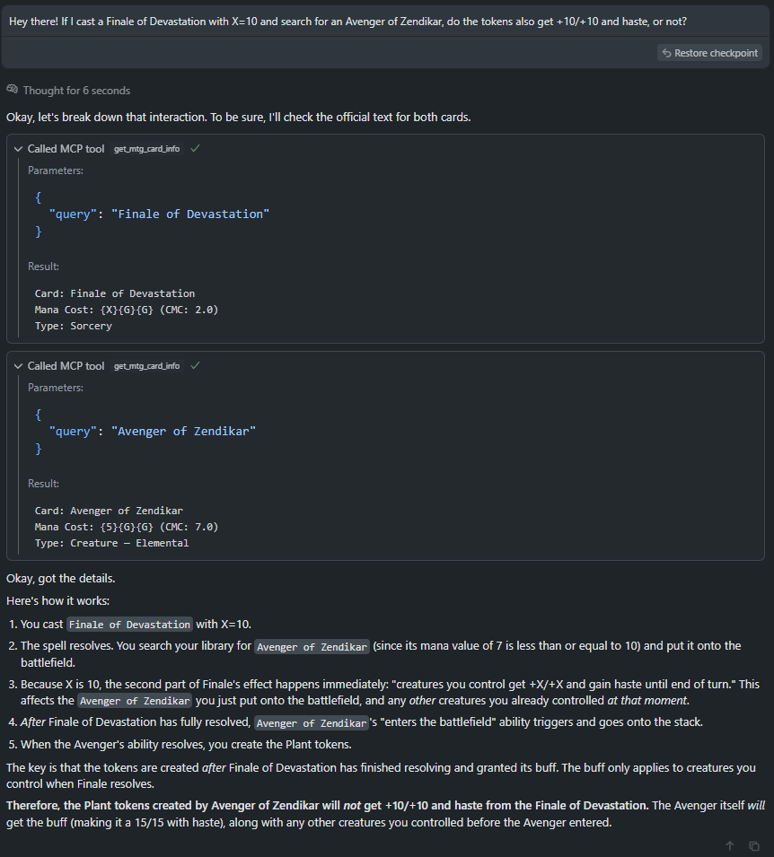

# MCP Server MTG Assistant

A Model Context Protocol server that provides Magic: The Gathering card information fetching capabilities using the Scryfall API. T

While primarily used for looking up specific card details, this server can also be a crucial first step in answering MTG rules questions. An effective agent workflow would be:
1.  Receive a rules question involving specific cards.
2.  Use the `get_mtg_card_info` tool to fetch the precise Oracle text and characteristics for *each* card mentioned. **Do not guess or assume card names or abilities.**
3.  Use the accurate card data retrieved from the tool, along with the original rules question, to formulate the final answer.

### Example Rules Question Workflow

Here's how the tool might be used to answer a rules question:

**User Query:** "If I cast a Finale of Devastation with X=10 and search for an Avenger of Zendikar, do the tokens also get +10/+10 and haste, or not?"



### Available Tools

-   `get_mtg_card_info` - Retrieves details for a specific Magic: The Gathering card from Scryfall.
    -   `query` (string, required): The search query string (e.g., card name, partial name, characteristics).

### Prompts

-   **get_mtg_card_info**
    -   Retrieves details for a specific Magic: The Gathering card from Scryfall.
    -   Arguments:
        -   `query` (string, required): Card name or search query.

## Installation and Running

This project uses [`uv`](https://docs.astral.sh/uv/) for dependency management and running scripts.

### Using uv (recommended)

Ensure `uv` is installed. You can run the server directly from the project directory:

```bash
# Navigate to the project root directory first
cd path/to/mcp-servers/mcp-mtg-assistant

# Install dependencies (if needed) and run the server script
uv run mcp-server-mtg-assistant
```

### Using PIP (for distribution or alternative setup)

If the package were published, you could install it via pip:

```bash
pip install mcp-server-mtg-assistant
```

After installation, you could run it as a script:

```bash
python -m mcp_server_mtg_assistant
```

For development, you typically run it using `uv run` as shown above.

## Configuration

### Configure for MCP Clients (e.g., Claude.app, Inspector)

Add an entry to your client's MCP server configuration. The exact key (`"mtg-assistant"` in the examples) can be chosen by you.

**Important:** The configuration needs to point `uv` to the correct project directory using the `--directory` argument. The path style (`/` vs `\`) depends on your operating system and how you run `uv`.

<details>
<summary>Default: Using uv Directly (Linux/macOS/WSL)</summary>

This is the standard approach if your MCP client and the server run in the same Linux, macOS, or WSL environment.

```json
// Example for mcp.json or Claude settings
"mcpServers": {
  "mtg-assistant": {
    "command": "uv",
    "args": [
      "--directory",
      "/path/to/mcp-servers/mcp-mtg-assistant", // Unix-style path
      "run",
      "mcp-server-mtg-assistant"
    ]
  }
}
```

</details>

<details>
<summary>Windows Client + WSL Server</summary>

This configuration is **recommended** if your MCP client runs on **Windows**, but you want the server to execute within **WSL** It uses `wsl.exe` to invoke `uv` inside WSL.

**Requirements:**
*   `uv` must be installed *inside* your WSL distribution.
*   Adjust the path to `uv` inside WSL (e.g., `/home/user/.cargo/bin/uv`) if it's not in the WSL `PATH`.
*   Use the `/mnt/...` style path for the `--directory` argument accessible from within WSL.

```json
// Example for mcp.json or Claude settings on Windows
"mcpServers": {
  "mtg-assistant": {
    "command": "wsl.exe",
    "args": [
      "/home/your-user/.cargo/bin/uv", // uv WSL PATH
      "--directory",
      "/mnt/d/repos/mcp-servers/mcp-mtg-assistant", // WSL-style path to project
      "run",
      "mcp-server-mtg-assistant"
    ]
  }
}
```

</details>

<details>
<summary>Alternative: Using uv Directly on Windows</summary>

This assumes `uv` is installed directly on Windows and your MCP client also runs directly on Windows.
*   Use the Windows-style path (`D:\...`) for the `--directory` argument.
*   Be mindful of potential `.venv` conflicts if you also use WSL (see below).

```json
// Example for mcp.json or Claude settings on Windows
"mcpServers": {
  "mtg-assistant": {
    "command": "uv",
    "args": [
      "--directory",
      "D:\path\to\mcp-servers\mcp-mtg-assistant", // Windows-style path
      "run",
      "mcp-server-mtg-assistant"
    ]
  }
}
```

</details>

### Handling `.venv` Conflicts (Different Environments)

*   **Problem:** `uv run` creates a `.venv` directory specific to the operating system/environment (e.g., Linux vs. Windows). If you switch between running the server directly on Windows and running it via WSL (or native Linux), the existing `.venv` might be incompatible.
*   **Solution:** Before switching environments, **delete the `.venv` directory** in the `mcp-mtg-assistant` project root. `uv run` will then create a fresh, compatible one for the environment you are using.

## Debugging

You can use the MCP inspector to debug the server by prefixing the command and arguments from your configuration with `npx @modelcontextprotocol/inspector`.

```bash
# Example using the Default (Linux/macOS/WSL) configuration:
npx @modelcontextprotocol/inspector uv --directory /path/to/mcp-servers/mcp-mtg-assistant run mcp-server-mtg-assistant

# Example using the Recommended (Windows Client + WSL Server) configuration:
npx @modelcontextprotocol/inspector wsl.exe /home/your-user/.cargo/bin/uv --directory /mnt/d/repos/mcp-servers/mcp-mtg-assistant run mcp-server-mtg-assistant

# Example using the Alternative (Direct Windows) configuration:
npx @modelcontextprotocol/inspector uv --directory D:\path\to\mcp-servers\mcp-mtg-assistant run mcp-server-mtg-assistant
```

## Contributing

We encourage contributions to help expand and improve this MTG Assistant MCP server. Whether you want to add new features, enhance existing functionality, or improve documentation, your input is valuable.

For examples of other MCP servers and implementation patterns, see:
https://github.com/modelcontextprotocol/servers

Pull requests are welcome! Feel free to contribute new ideas, bug fixes, or enhancements.

## License

mcp-server-mtg-assistant is licensed under the MIT License. This means you are free to use, modify, and distribute the software, subject to the terms and conditions of the MIT License.